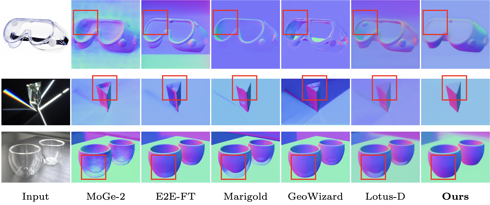
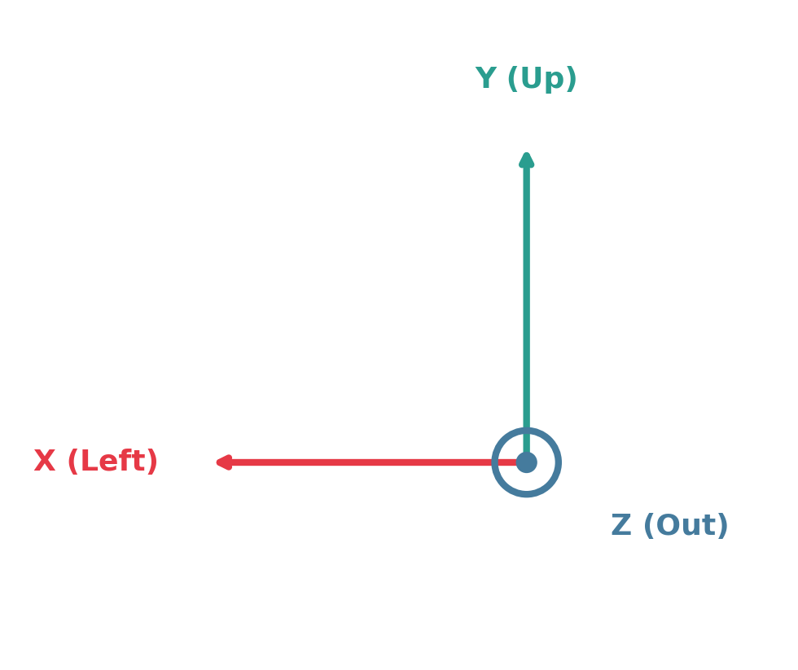

# TransNormal: Dense Visual Semantics for Diffusion-based Transparent Object Normal Estimation

<a href="#"></a>
[](https://arxiv.org/abs/2602.00839)
[](https://longxiang-ai.github.io/TransNormal/)
[](https://github.com/longxiang-ai/TransNormal)
[](https://longxiang-ai.github.io/TransNormal/)

Official implementation for the paper: **TransNormal: Dense Visual Semantics for Diffusion-based Transparent Object Normal Estimation**.

[Mingwei Li<sup>1,2</sup>](https://github.com/longxiang-ai), [Hehe Fan<sup>1</sup>](https://hehefan.github.io/), [Yi Yang<sup>1</sup>](https://scholar.google.com/citations?user=RMSuNFwAAAAJ&hl=en)

*<sup>1</sup>Zhejiang University, <sup>2</sup>Zhongguancun Academy*

## News

* **[2026-02-03]**: arXiv paper released. [[arXiv](https://arxiv.org/abs/2602.00839)]
* **[2026-01-30]**: Project page updated. Code and dataset will be released soon.

## Teaser


*Qualitative comparisons on transparent object normal estimation with multiple baselines.*

## Method Overview


*Overview of TransNormal: dense visual semantics guide diffusion-based single-step normal prediction with wavelet regularization.*

## Installation

### Requirements

- Python >= 3.8
- PyTorch >= 2.0.0
- CUDA >= 11.8 (recommended for GPU inference)

**Tested Environment:**
- NVIDIA Driver: 580.65.06
- CUDA: 13.0
- PyTorch: 2.4.0+cu121
- Python: 3.10

### Install Dependencies

```bash
# Clone the repository
git clone https://github.com/longxiang-ai/TransNormal.git
cd TransNormal

# Create and activate conda environment
conda create -n TransNormal python=3.10 -y
conda activate TransNormal

# Install dependencies
pip install -r requirements.txt
```

### Download Model Weights

#### 1. TransNormal Weights
```bash
pip install huggingface_hub

# Download TransNormal model
python -c "from huggingface_hub import snapshot_download; snapshot_download('Longxiang-ai/TransNormal', local_dir='./weights/transnormal')"
```

#### 2. DINOv3 Weights (Requires Access Request)

> **⚠️ Important:** DINOv3 weights require access approval from Meta AI.

1. Visit [Meta AI DINOv3 Downloads](https://ai.meta.com/resources/models-and-libraries/dinov3-downloads/) to request access
2. After approval, download the **ViT-H+/16 distilled** model
3. Or use HuggingFace Transformers (version >= 4.56.0):
```bash
python -c "from huggingface_hub import snapshot_download; snapshot_download('facebook/dinov3-vith16plus-pretrain-lvd1689m', local_dir='./weights/dinov3_vith16plus')"
```

See [weights/README.md](weights/README.md) for detailed instructions.

## Quick Start

### Python API

```python
from transnormal import TransNormalPipeline, create_dino_encoder
import torch

# Create DINO encoder
# Note: Use bfloat16 instead of float16 to avoid NaN issues with DINOv3
dino_encoder = create_dino_encoder(
    model_name="dinov3_vith16plus",
    weights_path="./weights/dinov3_vith16plus",
    projector_path="./weights/transnormal/cross_attention_projector.pt",
    device="cuda",
    dtype=torch.bfloat16,
)

# Load pipeline
pipe = TransNormalPipeline.from_pretrained(
    "./weights/transnormal",
    dino_encoder=dino_encoder,
    torch_dtype=torch.bfloat16,
)
pipe = pipe.to("cuda")

# Run inference
normal_map = pipe(
    image="path/to/image.jpg",
    output_type="np",  # "np", "pil", or "pt"
)

# Save result
from transnormal import save_normal_map
save_normal_map(normal_map, "output_normal.png")
```

### Command Line Interface

**Single Image:**
```bash
python inference.py \
    --image path/to/image.jpg \
    --output normal.png \
    --model_path ./weights/transnormal \
    --dino_path ./weights/dinov3_vith16plus \
    --projector_path ./weights/cross_attention_projector.pt
```

**Batch Processing:**
```bash
python inference_batch.py \
    --input_dir ./examples/input \
    --output_dir ./examples/output \
    --model_path ./weights/transnormal \
    --dino_path ./weights/dinov3_vith16plus
```

### Gradio Web UI

Launch an interactive web interface:
```bash
python gradio_app.py --port 7860
```

Then open `http://localhost:7860` in your browser. Use `--share` for a public link.

## Output Format

The output normal map represents surface normals in **camera coordinate system**:

<p align="center">
  
</p>

- **X** (Red channel): Left direction (positive = left)
- **Y** (Green channel): Up direction (positive = up)
- **Z** (Blue channel): Out of screen (positive = towards viewer)

Output values are in range `[0, 1]` where `0.5` represents zero in each axis.

## Inference Efficiency

Benchmark results on a single GPU (averaged over multiple runs):

| Precision | Time (ms) | FPS | Peak Mem (MB) | Model Load (MB) |
|-----------|-----------|-----|---------------|-----------------|
| **BF16**  | 248       | 4.0 | 11098         | 7447            |
| FP16      | 248       | 4.0 | 11098         | 7447            |
| FP32      | 615       | 1.6 | 10468         | 8256            |

> **Note:** BF16 is recommended over FP16 to avoid potential NaN issues with DINOv3.

## Dataset

We introduce **TransNormal-Synthetic**, a physics-based dataset of transparent labware with rich annotations. Dataset release and download links will be provided soon.

## Citation

If you find our work useful, please consider citing:

```bibtex
@misc{li2026transnormal,
      title={TransNormal: Dense Visual Semantics for Diffusion-based Transparent Object Normal Estimation}, 
      author={Mingwei Li and Hehe Fan and Yi Yang},
      year={2026},
      eprint={2602.00839},
      archivePrefix={arXiv},
      primaryClass={cs.CV},
      url={https://arxiv.org/abs/2602.00839}, 
}
```

## Acknowledgements

This work builds upon:
- [Lotus](https://github.com/EnVision-Research/Lotus) - Diffusion-based depth and normal estimation
- [DINOv3](https://github.com/facebookresearch/dinov3) - Self-supervised vision transformer from Meta AI
- [Stable Diffusion 2](https://www.modelscope.cn/AI-ModelScope/stable-diffusion-2-base) - Base diffusion model

## License

This project is licensed under [CC BY-NC 4.0](https://creativecommons.org/licenses/by-nc/4.0/) (Creative Commons Attribution-NonCommercial 4.0). See the [LICENSE](LICENSE) file for details.

For commercial licensing inquiries, please contact the authors.

## Contact

For questions or issues, please open a GitHub issue or contact the authors.
