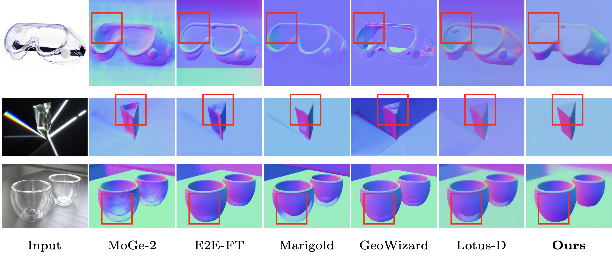
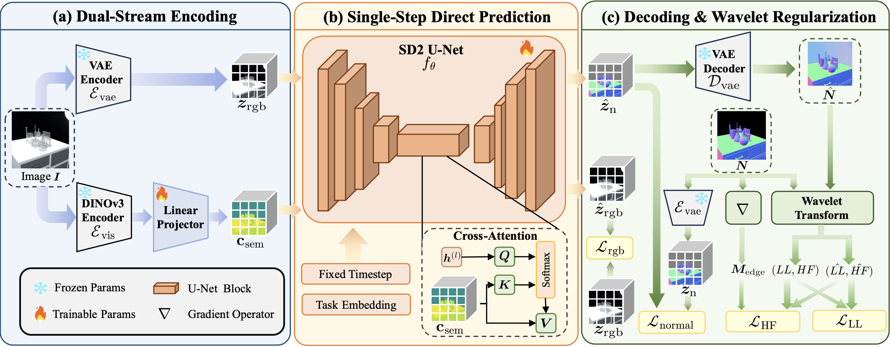
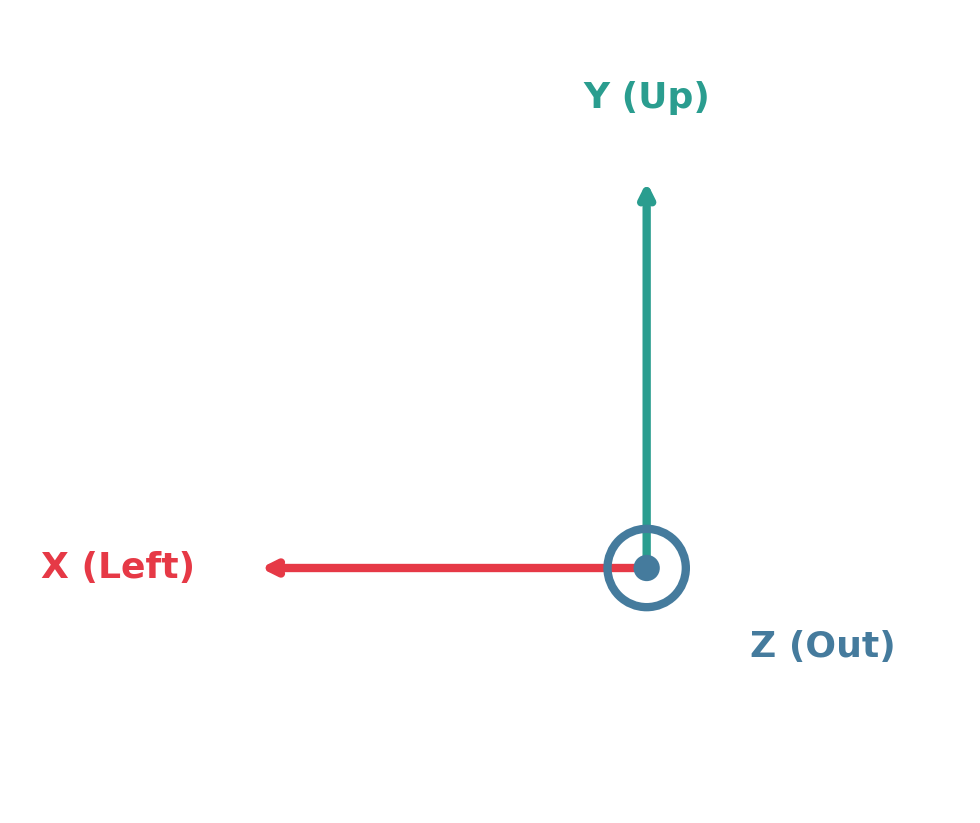

# TransNormal: Dense Visual Semantics for Diffusion-based Transparent Object Normal Estimation

<a href="#"></a>
[](https://icml.cc/)
[](https://arxiv.org/abs/2602.00839)
[](https://longxiang-ai.github.io/TransNormal/)
[](https://github.com/longxiang-ai/TransNormal)
[](https://huggingface.co/Longxiang-ai/TransNormal)
[](https://huggingface.co/datasets/Longxiang-ai/TransNormal-Synthetic)

Official implementation for the paper: **TransNormal: Dense Visual Semantics for Diffusion-based Transparent Object Normal Estimation**.

[Mingwei Li<sup>1,2</sup>](https://github.com/longxiang-ai), [Hehe Fan<sup>1</sup>](https://hehefan.github.io/), [Yi Yang<sup>1</sup>](https://scholar.google.com/citations?user=RMSuNFwAAAAJ&hl=en)

*<sup>1</sup>Zhejiang University, <sup>2</sup>Zhongguancun Academy*

## TL;DR

- RGB-only surface normal estimation for transparent objects.
- Dense DINOv3 visual semantics injected into a diffusion geometry prior.
- State-of-the-art results on ClearGrasp and ClearPose.
- Includes training and inference workflows, pretrained model weights, and the TransNormal-Synthetic dataset.

## News

* **[2026-09-09]**: Our new work, **TransNormal-2**, is now released, with further improvements in surface normal estimation. [[GitHub](https://github.com/longxiang-ai/TransNormal-2)]

* **[2026-09-09]**: Added the formal training workflow, data preparation, checkpoint recovery, inference export, and evaluation workflows for all six paper normal benchmarks. [[Training](docs/training.md)] [[Data preparation](docs/data.md)] [[Evaluation](docs/evaluation.md)]

* **[2026-05-01]**: TransNormal has been accepted to **ICML 2026**!
* **[2026-02-06]**: TransNormal-Synthetic dataset released on HuggingFace. [[Dataset](https://huggingface.co/datasets/Longxiang-ai/TransNormal-Synthetic)]
* **[2026-02-03]**: arXiv paper released. [[arXiv](https://arxiv.org/abs/2602.00839)]
* **[2026-01-30]**: Project page launched.

## TODO

- [x] Release inference code.
- [x] Release model weights.
- [x] Release TransNormal-Synthetic dataset.
- [x] Provide the formal training workflow and configuration.
- [x] Provide fixed splits, data preparation and evaluation for all six normal benchmarks.
- [x] Provide ClearPose GT rendering.

## Teaser


*Qualitative comparisons on transparent object normal estimation with multiple baselines.*

## Method Overview


*Overview of TransNormal: dense visual semantics guide diffusion-based single-step normal prediction with wavelet regularization.*

## Installation

### Requirements

- Python 3.10 (tested for training, inference and evaluation)
- PyTorch >= 2.0.0
- CUDA >= 11.8 (recommended for GPU inference)

**Tested Environment:**
- NVIDIA Driver: 580.65.06
- CUDA: 13.0
- PyTorch: 2.4.0+cu121
- Python: 3.10

### Install Dependencies

```bash
# Clone the repository
git clone https://github.com/longxiang-ai/TransNormal.git
cd TransNormal

# Create and activate conda environment
conda create -n TransNormal python=3.10 -y
conda activate TransNormal

# Install dependencies
pip install -r requirements.txt
```

### Download Model Weights

#### 1. TransNormal Weights
```bash
pip install huggingface_hub

# Download TransNormal model
python -c "from huggingface_hub import snapshot_download; snapshot_download('Longxiang-ai/TransNormal', revision='796f97ad3d82ea2e455bed88afe3c33aca8e115f', local_dir='./weights/transnormal')"
```

#### 2. DINOv3 Weights (Requires Access Request)

> **⚠️ Important:** DINOv3 weights require access approval from Meta AI.

1. Visit [Meta AI DINOv3 Downloads](https://ai.meta.com/resources/models-and-libraries/dinov3-downloads/) to request access
2. After approval, download the **ViT-H+/16 distilled** model
3. Or use HuggingFace Transformers (version >= 4.56.0):
```bash
python -c "from huggingface_hub import snapshot_download; snapshot_download('facebook/dinov3-vith16plus-pretrain-lvd1689m', local_dir='./weights/dinov3_vith16plus')"
```

See [weights/README.md](weights/README.md) for detailed instructions.

## Quick Start

### Python API

```python
from transnormal import TransNormalPipeline, create_dino_encoder
import torch

# Create DINO encoder
# Note: Use bfloat16 instead of float16 to avoid NaN issues with DINOv3
dino_encoder = create_dino_encoder(
    model_name="dinov3_vith16plus",
    weights_path="./weights/dinov3_vith16plus",
    projector_path="./weights/transnormal/cross_attention_projector.pt",
    device="cuda",
    dtype=torch.bfloat16,
)

# Load pipeline
pipe = TransNormalPipeline.from_pretrained(
    "./weights/transnormal",
    dino_encoder=dino_encoder,
    torch_dtype=torch.bfloat16,
)
pipe = pipe.to("cuda")

# Run inference
normal_map = pipe(
    image="path/to/image.jpg",
    output_type="np",  # "np", "pil", or "pt"
)

# Save result
from transnormal import save_normal_map
save_normal_map(normal_map, "output_normal.png")
```

### Command Line Interface

**Single Image:**
```bash
python inference.py \
    --input path/to/image.jpg \
    --output normal.png \
    --model_path ./weights/transnormal \
    --dino_path ./weights/dinov3_vith16plus \
    --projector_path ./weights/transnormal/cross_attention_projector.pt
```

**Batch Processing:**
```bash
python inference.py \
    --input ./examples/input \
    --output ./examples/output \
    --model_path ./weights/transnormal \
    --dino_path ./weights/dinov3_vith16plus
```

Directory inputs load the model once and write `<name>_normal.png` for each image. Add `--recursive` to preserve subdirectories, `--skip_existing` to resume, or `--save_comparison` for side-by-side RGB/normal previews. Single-image inputs use the exact `--output` filename. Use `--output_format npz` for directories or an `.npz` output filename for a single image; NPZ files contain an H × W × 3 floating-point `normal` array in [0, 1].

### Gradio Web UI

Launch an interactive web interface:
```bash
python gradio_app.py --port 7860
```

Then open `http://localhost:7860` in your browser.

## Output Format

The output normal map represents surface normals in **camera coordinate system**:

<p align="center">
  
</p>

- **X** (Red channel): Left direction (positive = left)
- **Y** (Green channel): Up direction (positive = up)
- **Z** (Blue channel): Out of screen (positive = towards viewer)

Output values are in range `[0, 1]` where `0.5` represents zero in each axis.

## Inference Efficiency

Benchmark results on a single GPU (averaged over multiple runs):

| Precision | Time (ms) | FPS | Peak Mem (MB) | Model Load (MB) |
|-----------|-----------|-----|---------------|-----------------|
| **BF16**  | 248       | 4.0 | 11098         | 7447            |
| FP16      | 248       | 4.0 | 11098         | 7447            |
| FP32      | 615       | 1.6 | 10468         | 8256            |

> **Note:** BF16 is recommended over FP16 to avoid potential NaN issues with DINOv3.

## Dataset

We introduce **TransNormal-Synthetic**, a physics-based dataset of transparent labware with rich annotations.

**Download:** [HuggingFace](https://huggingface.co/datasets/Longxiang-ai/TransNormal-Synthetic)

| Property | Value |
|----------|-------|
| Total views | 4,000 |
| Scenes | 10 |
| Image resolution | 800 x 800 |
| Format | WebDataset (.tar shards) |
| Total size | ~7.5 GB |
| License | CC BY-NC 4.0 |

Each sample contains paired RGB images (with/without transparent objects), surface normal maps, depth maps, object masks (all / transparent-only), material-changed RGB, and camera metadata (intrinsics).

```python
import webdataset as wds

dataset = wds.WebDataset(
    "hf://datasets/Longxiang-ai/TransNormal-Synthetic/transnormal-{000000..000007}.tar"
).decode("pil")

for sample in dataset:
    rgb = sample["with_rgb.png"]
    normal = sample["with_normal.png"]
    mask = sample["with_mask_transparent.png"]
    break
```

## Training

The formal training workflow is provided in [`docs/training.md`](docs/training.md), including dataset preparation, the final model configuration, distributed training, checkpoint recovery and inference export.

```bash
pip install -r requirements-training.txt
python train.py --config configs/train.yaml --check-data
accelerate launch --multi_gpu --num_processes 8 --mixed_precision bf16 train.py --config configs/train.yaml
```

Prepare the four dataset indices and pretrained components as described in the guide before starting training. The default recipe trains the UNet and visual projector while keeping the DINOv3 backbone and VAE frozen. Model exports remain compatible with the inference examples above.

## Evaluation

[`docs/evaluation.md`](docs/evaluation.md) covers **ClearGrasp Synthetic, TransNormal-Synthetic, ClearPose, NYUv2, ScanNet and iBims-1**: downloads, fixed test lists, GT and mask conventions, inference, pixel-pooled metrics and RNG replay.

```bash
pip install -r requirements-training.txt
# Set your dataset roots in configs/evaluation.json first.
python evaluate.py --dataset all --check-data
python evaluate.py --dataset all \
  --model-path weights/transnormal --dino-path weights/dinov3_vith16plus \
  --seed 42 --output outputs/paper_eval
```

Use `--dataset clearpose` (or another dataset name) for an individual benchmark. Results include raw float predictions, per-image metrics, a CSV summary and initial RNG states.

See [data preparation](docs/data.md) for training layouts, transformations, and ClearPose GT rendering.

## Citation

If you find our work useful, please consider citing TransNormal and our follow-up work, [TransNormal-2](https://github.com/longxiang-ai/TransNormal-2):

```bibtex
@misc{li2026transnormal,
      title={TransNormal: Dense Visual Semantics for Diffusion-based Transparent Object Normal Estimation}, 
      author={Mingwei Li and Hehe Fan and Yi Yang},
      year={2026},
      eprint={2602.00839},
      archivePrefix={arXiv},
      primaryClass={cs.CV},
      url={https://arxiv.org/abs/2602.00839}, 
}

@misc{li2026transnormal2,
  title = {TransNormal-2: Geometry-Grounded Rectified Flow with Edge-Aware Decoding for Precise Normal Estimation},
  author = {Mingwei Li and Yi Yang and Hehe Fan},
  year = {2026},
  eprint = {2609.06665},
  archivePrefix = {arXiv},
  primaryClass = {cs.CV},
  url = {https://arxiv.org/abs/2609.06665}
}
```

## Acknowledgements

This work builds upon:
- [Lotus](https://github.com/EnVision-Research/Lotus) - Diffusion-based depth and normal estimation
- [DINOv3](https://github.com/facebookresearch/dinov3) - Self-supervised vision transformer from Meta AI
- [Stable Diffusion 2](https://www.modelscope.cn/AI-ModelScope/stable-diffusion-2-base) - Base diffusion model

## License

This project is licensed under [CC BY-NC 4.0](https://creativecommons.org/licenses/by-nc/4.0/) (Creative Commons Attribution-NonCommercial 4.0). See the [LICENSE](LICENSE) file for details.

Adapted upstream components retain their applicable terms; see [third-party acknowledgements](docs/third_party.md) and [Apache-2.0](LICENSE-APACHE-2.0.txt).

For commercial licensing inquiries, please contact the authors.

## Contact

For questions or issues, please open a GitHub issue or contact the authors.
